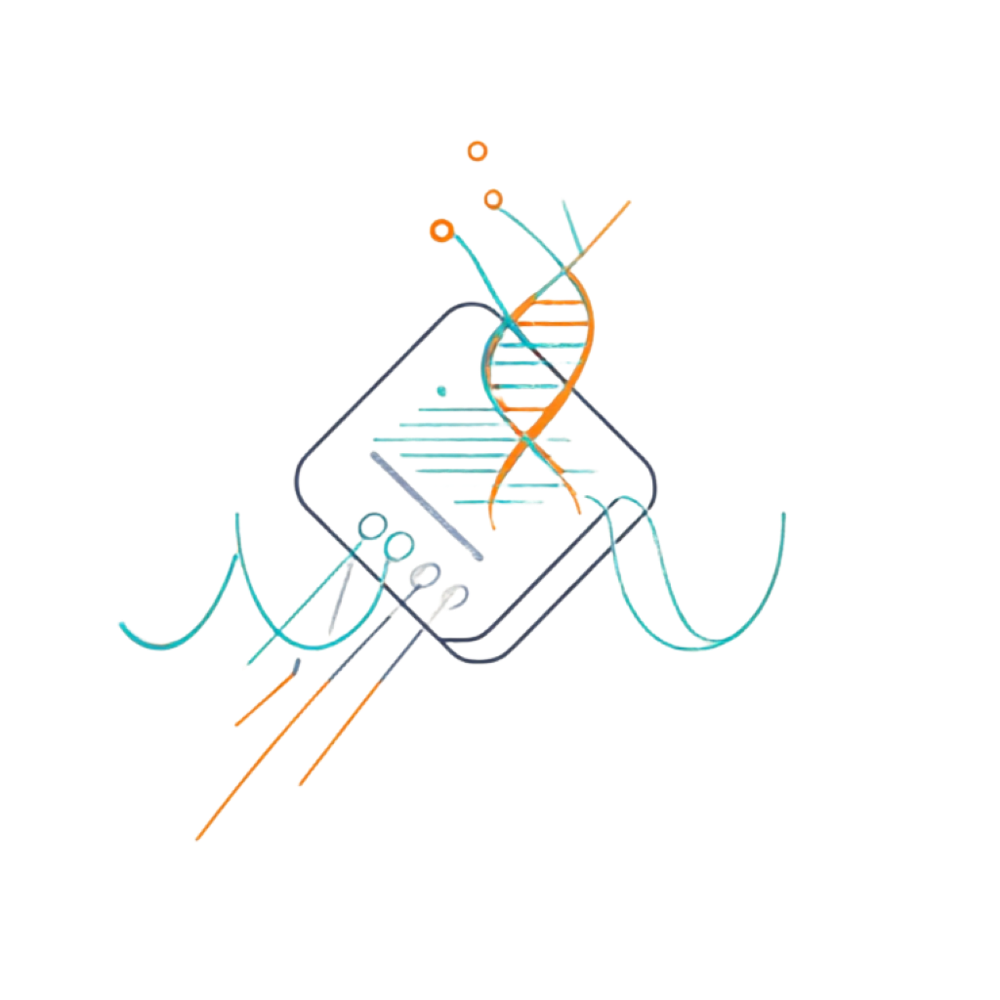

<!-- markdownlint-disable -->

<div align="center">



# OpenPICL

<br>
<div>
    <a href="http://docs.openpicl.com"></a>
    <a href="http://docs.openpicl.com/en"></a>
</div>
<div>
    <a href="http://website.openpicl.com"></a>
</div>
<div>
    
    
</div>
<div>
    
</div>
<div>
    
    
</div>
<div>
    
</div>
<div>
    <a href="https://deepwiki.com/CFPIF/OpenPICL"></a>
</div>
<div>
    <a href="./README.md">English</a> | <a href="./README-zh.md">Simplified Chinese</a>
    <br />
    <a href="#-quick-start">Qucik Start</a> · <a href="#aa">AA</a>
</div>
<br>

<!-- markdownlint-restore -->

Open Photon Intelligence Comprehensive Laboratory

</div>

## 🗞️ News

- **2026-10-11** — [v0.1.1 released!](https://github.com/CFPIF/OpenPICL/releases/tag/v0.1.1) Community and basic functions. See [changelog](CHANGELOG.md).

## 📖 Overview

**OpenPICL** (Open Photon Intelligence Comprehensive Laboratory) is an open-source photon intelligence comprehensive laboratory that provides an open community for photon intelligence communication, covering the entire process of photon intelligence design, implementation, and verification.

### Highlights

---

>[!TIP]
>[Learn more →](#-integration)

---

## 🚀 Quick Start

### Docker Compose Deployment

### Kubernetes Deployment

---

## ✨ Features

---

## 🤝 Contributing

We welcome contributions from the community! Whether it's bug reports, feature ideas, or pull requests — every bit helps.

### Project Structure

```
OpenPICL/
├── pixi/           # Pixi Workspace
|  ├── packages/    # Pixi Backages
```

### How to Contribute

1. Fork the repository
2. Create your feature brunch (`git checkout -b feature/amazing-feature`)
3. Commit your changes (`git commit -m 'Add amazing feature'`)
4. Push to the branch (`git push origin feature/amazing-feature`)
5. Open a Pull Request

---

## ⭐ Star History

[](https://star-history.com/#CFPIF/OpenPICL&Date)

---

## 📄 许可证

This project is licensed under the [GPL-3.0 License](LICENSE).